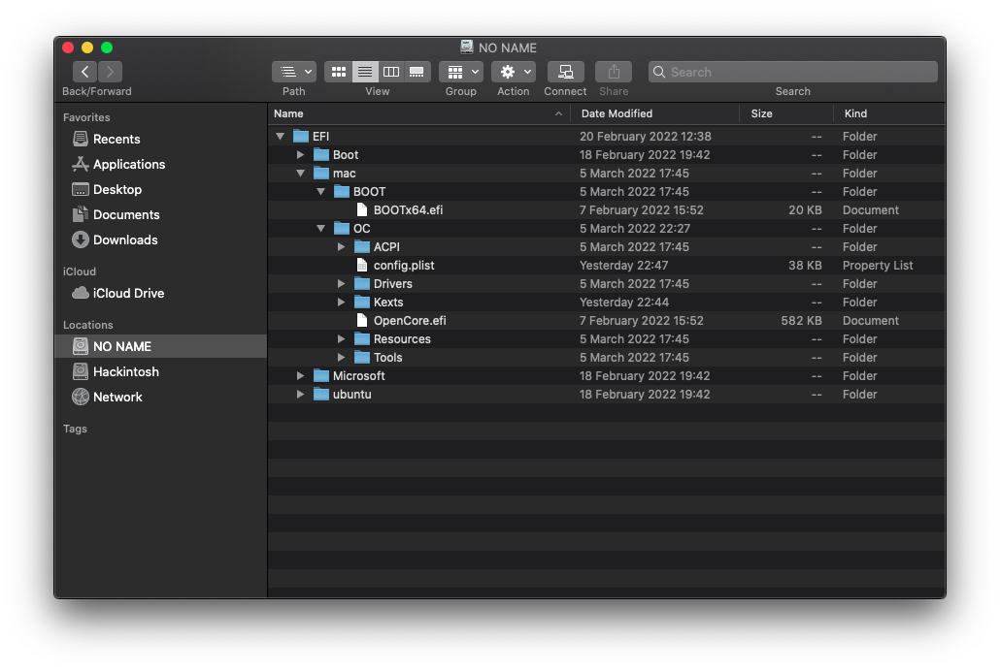

# Multi-Boot using GRUB

[](https://github.com/acidanthera/OpenCorePkg)
[](https://en.wikipedia.org/wiki/MacOS_Catalina)


Disclaimer: it is recommended to [multi-boot with OpenCore](https://dortania.github.io/OpenCore-Multiboot/) instead, I'm not responsible if this breaks your system!!

This guide assumes you have the following config:
* UEFI firmware
* One disk for all OSes
* A Linux distro using GRUB as the boot loader already installed

## EFI directory structure

1. Mount your EFI ([MountEFI](https://github.com/corpnewt/MountEFI))
1. Create `mac` folder
2. Move `BOOT` and `OC` inside it



## config.plist

From:
* `Misc -> Boot -> LauncherOption = Disabled`
* `Misc -> Boot -> LauncherPath = Default`
* `UEFI -> Quirks -> RequestBootVarRouting = False`

To:
* `Misc -> Boot -> LauncherOption = Full`
    * Adds OpenCore entry in BIOS **(do not change this if booting from a removable drive)**
* `Misc -> Boot -> LauncherPath = \EFI\mac\OC\OpenCore.efi`
    * Sets OpenCore.efi path
* `UEFI -> Quirks -> RequestBootVarRouting = True`

## Custom GRUB entry

1. Edit `/etc/grub.d/40_custom` and add the entry:

```bash
menuentry "macOS Catalina" {
    savedefault
    insmod chain
    insmod part_gpt
    insmod fat
    set root='hd0,gpt4'
        if [ x$feature_platform_search_hint = xy ]; then
          search --no-floppy --fs-uuid --set=root --hint-bios=hd0,gpt4 --hint-efi=hd0,gpt4 --hint-baremetal=ahci0,gpt4  3985-6371
        else
          search --no-floppy --fs-uuid --set=root 3985-6371
        fi
    chainloader /EFI/mac/OC/OpenCore.efi
}
```

2. Replace `hd0`, `gpt4` and `3985-6371` (UUID) according to your EFI partition. You can get the correct values by using the `blkid` utility to list all partitions UUIDs:


```bash
sudo blkid

/dev/sda4: UUID="3985-6371" BLOCK_SIZE="512" TYPE="vfat" PARTLABEL="EFI" PARTUUID="..."
/dev/sda2: UUID="05c35cee-7d6b-409d-b71f-99b1ee079561" BLOCK_SIZE="4096" TYPE="ext4" PARTLABEL="Arch" PARTUUID="..."
/dev/sda5: UUID="c1ab1a77-f2da-4765-9472-3a996f37dd12" BLOCK_SIZE="4096" TYPE="apfs" PARTUUID="..."
/dev/sda3: UUID="d0b49e6c-86dc-4261-88c9-90325f6c63a1" TYPE="swap" PARTUUID="..."
/dev/sda1: BLOCK_SIZE="512" UUID="D2AEC893AEC87211" TYPE="ntfs" PARTLABEL="Basic data partition" PARTUUID="..."
```

3. Update GRUB:

```
sudo update-grub
```

4. Done!

## Credits

Based on [SayantanRC's guide](https://github.com/SayantanRC/URLs/blob/master/grub_to_opencore.md).
