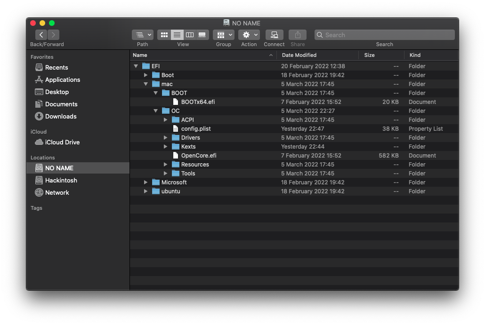

# Triple Boot Guide using GRUB
[](https://github.com/acidanthera/OpenCorePkg)
[](https://en.wikipedia.org/wiki/MacOS_Catalina)


This guide assumes a Linux distro using GRUB as the boot loader is already installed.

## EFI directory structure:


1. Create `mac` folder
2. Move `BOOT` and `OC` inside it

## `config.plist` changes:
From:
* `Misc -> Boot -> LauncherOption - Disabled`
* `Misc -> Boot -> LauncherPath - Default`

To:
* `Misc -> Boot -> LauncherOption - Full`
    * Adds OpenCore entry in BIOS **(do not change this if booting from a removable drive)**
* `Misc -> Boot -> LauncherPath - \EFI\mac\OC\OpenCore.efi`
    * Sets OpenCore.efi path

## Custom GRUB entry:
1. Edit `/etc/grub.d/40_custom` and add the entry:
```
menuentry "MacOS" $menuentry_id_option 'macOS-efi' {
	insmod chain
	insmod part_gpt
	insmod fat
	set root='hd0,gpt1'
	chainloader /efi/mac/OC/OpenCore.efi
	set root='hd0,gpt1'/efi/mac
}
```
2. Replace `hd0` and `gpt1` according to your EFI partition.
3. Update GRUB:
```
sudo update-grub
```
4. Done!

## Credits
Based on [SayantanRC's guide](https://github.com/SayantanRC/URLs/blob/master/grub_to_opencore.md).